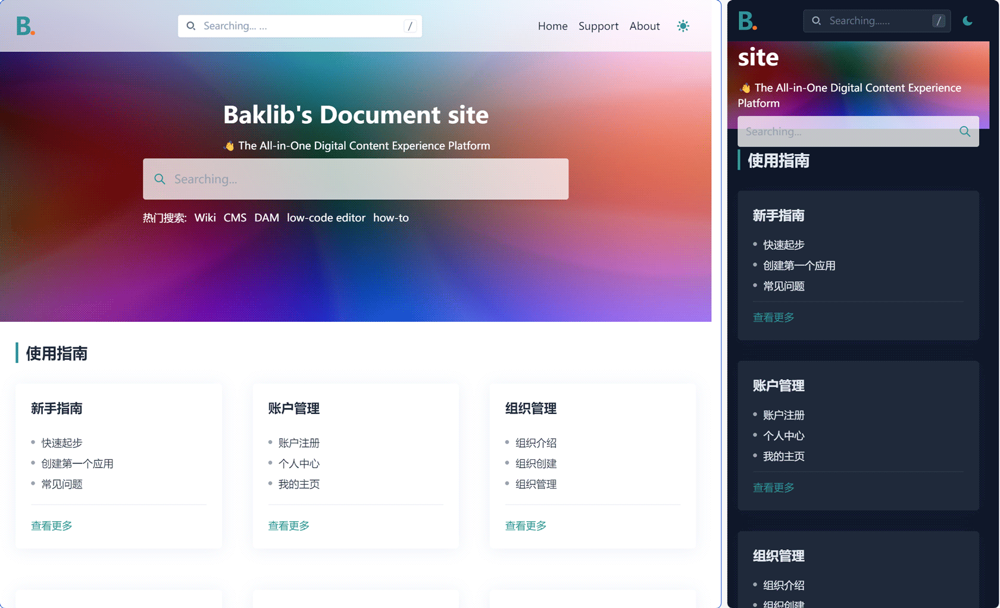
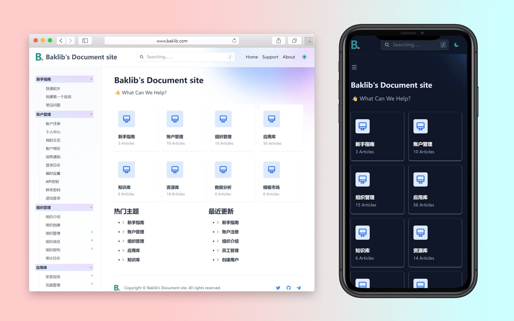
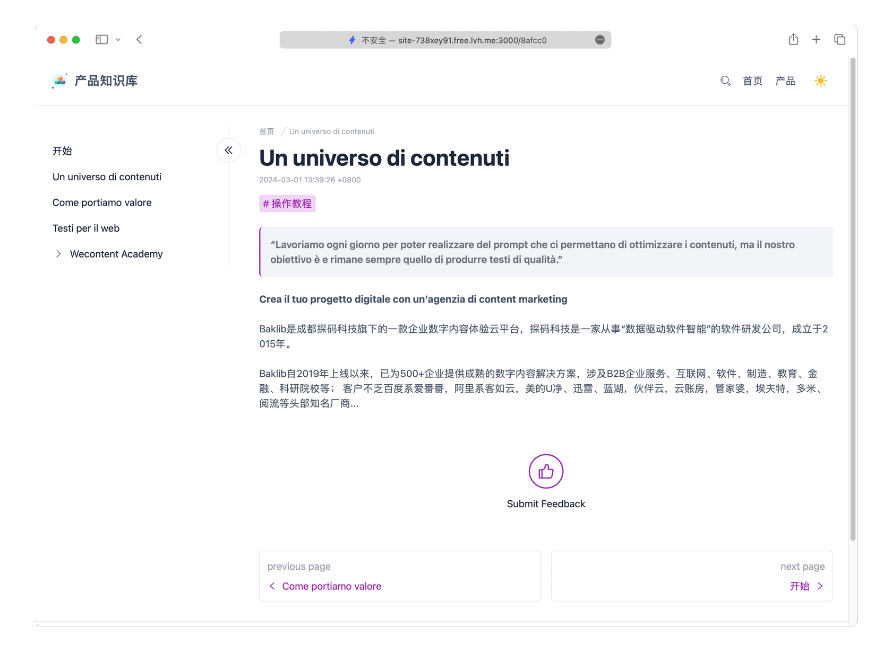

# Baklib Wiki Template

Content synchronized from knowledge base, for Large-scale reusable document content management, like Wiki, Documentation, and content portal.

Knowledge base template deployed by Baklib WIKI.





## 🚀 Project Structure

```
  .
  ├── README.md
  ├── config
  │   └── settings_schema.json
  ├── layout
  │   ├── error.liquid
  │   └── theme.liquid
  ├── package-lock.json
  ├── package.json
  ├── snippets
  │   ├── _breadcrumb copy.liquid
  │   ├── _breadcrumb.liquid
  │   ├── _custom_menu.liquid
  │   ├── _export_page.liquid
  │   ├── _export_tree.liquid
  │   ├── _feedback_form.liquid
  │   ├── _footer.liquid
  │   ├── _header.liquid
  │   ├── _index_tree.liquid
  │   ├── _page.liquid
  │   ├── _page_list.liquid
  │   ├── _paginate.liquid
  │   ├── _plugins.liquid
  │   ├── _sidebar.liquid
  │   ├── _tag.liquid
  │   └── _tree.liquid
  ├── statics
  │   └── about.liquid
  ├── tailwind.config.js
  ├── templates
  │   ├── index.docs.liquid
  │   ├── index.help_center.liquid
  │   ├── index.list.liquid
  │   ├── nav_tree.liquid
  │   ├── page.export.liquid
  │   ├── page.liquid
  │   ├── search.liquid
  │   └── tag.liquid
  ├── yarn-error.log
  └── yarn.lock
```


## 🧞 Install guide

- The Template install Guide: https://help.baklib.cn/themes/wiki

- The Baklib template install Guide: https://dev.baklib.cn/guide/git

## 开发

```bash
npm run dev
```

### 安装配置TailwindCSS
[TailwindCSS官网](https://www.tailwindcss.cn/docs/installation)

#### 1.安装Tailwindcss
通过`npm`安装`tailwindcss`，然后创建`tailwind.config.js`配置文件
```bash
npm add -D tailwindcss
npx tailwindcss init
```
#### 2.配置模板文件的路径和自定义样式
```javascript
/** @type {import('tailwindcss').Config} */
module.exports = {
  content: ["./templates/**/*.liquid", "./snippets/**/*.liquid", "./layout/**/*.liquid", "./statics/**/*.liquid"],
  darkMode: 'class',
  theme: {
    extend: {
      colors: () => {
        return {
          slate: {
            150: "#E9EEF5"
          },
          ...["primary", "secondary", "accent", "info", "success", "warning"].reduce((map, name) => {
            return {
              ...map,
              [name]: {
                DEFAULT: `hsl(var(--theme-color-${name}) / <alpha-value>)`,
                lighten: `hsl(var(--theme-color-${name}-hsl-h) var(--theme-color-${name}-hsl-s) calc(var(--theme-color-${name}-hsl-l) + 15%))`,
                darken: `hsl(var(--theme-color-${name}-hsl-h) var(--theme-color-${name}-hsl-s) calc(var(--theme-color-${name}-hsl-l) - 15%))`,
                ...[50, 100, 200, 300, 400, 500, 600, 700, 800, 900, 950].reduce((map,lightness) => {
                  return {
                    ...map,
                    [lightness]: `hsl(var(--theme-color-${name}-hsl-h) var(--theme-color-${name}-hsl-s) ${100 - lightness/10*0.8}%)`
                  }
                }, {})
              }
            }
          }, {}),
          // 错误色永远是红色，饱和度与主色调保持一致
          error: {
            DEFAULT: `hsl(355 75% var(--theme-color-primary-hsl-l) / <alpha-value>)`,
            lighten: `hsl(355 75% calc(var(--theme-color-primary-hsl-l) + 15%))`,
            darken: `hsl(355 75% calc(var(--theme-color-primary-hsl-l) - 15%))`,
            ...[50, 100, 200, 300, 400, 500, 600, 700, 800, 900, 950].reduce((map,lightness) => {
              return {
                ...map,
                [lightness]: `hsl(355 75% ${100 - lightness/10*0.8}%)`
              }
            }, {})
          }
        }
      },
      spacing: {
        4.5: "1.125rem",
        5.5: "1.375rem",
        18: "4.5rem",
      },
    },
  },
  plugins: [],
}
```
#### 3.引入Tailwindcss到css文件中
例如：`./src/main.css`
```css
@tailwind base;
@tailwind components;
@tailwind utilities;
@config '../tailwind.config.js'
```
#### 4.在`package.json`中配置css编译路径
```json
"scripts": {
  "build": "npm-run-all --parallel build:css build:js",
  "build:css": "npx tailwindcss -i ./src/main.css -o ./assets/css/main.css",
  ......
  "dev": "npm-run-all --parallel 'build:css -- --watch' 'build:js -- --watch'"
}
```
#### 5.在`theme.liquid`文件中引入css
```html
{{ 'css/main.css' | asset_url | stylesheet_tag: data-turbo-track: 'reload' }}
```


## 编译&发布

```bash
yarn build
```
